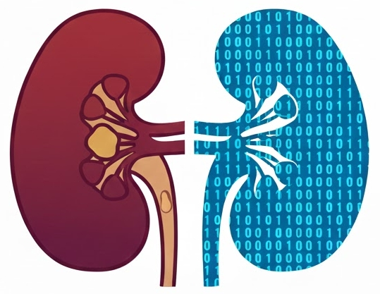
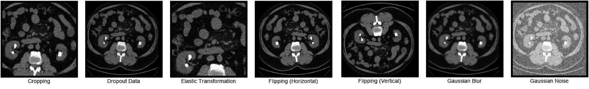
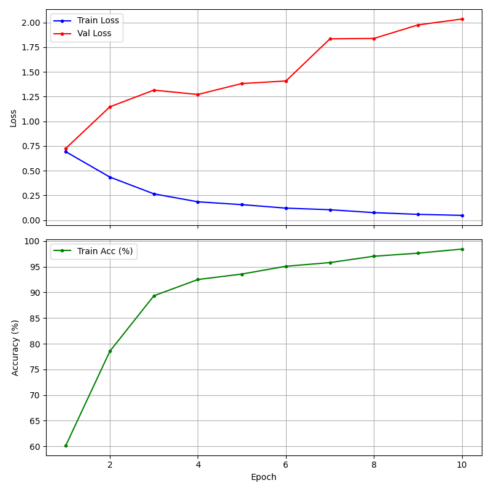
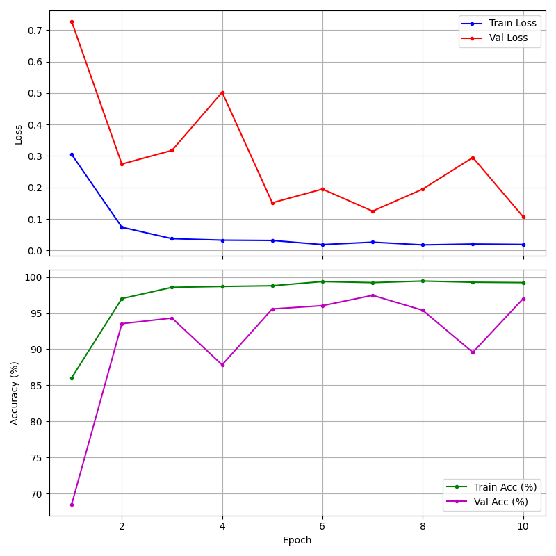

# Deep Learning for Nephrolithiasis



Binary classification of renal CT slices to detect kidney stones (renal calculi). This repo contains a simple CNN trained from scratch and transfer-learning pipelines using EfficientNet and MobileNet, with a data pipeline tailored for per-patient train/validation splits and optional augmentation.

## Overview
- **Goal:** Classify CT slices as `Stone` or `Non-Stone` to assist radiologists and healthcare professionals.
- **Approach:**
	- A compact, custom **CNN** trained from scratch on grayscale images.
	- **Transfer learning** with EfficientNet and MobileNet pretrained on ImageNet.
- **Data handling:** Grayscale conversion, resize to 224×224, normalization; robust to varied hospital formats; per-patient split to reduce leakage.
- **Results (example):** EfficientNet B0/B5 achieve >95% accuracy; fine-tuned B5 approaches ~97.5% on validation patients.

## Dataset
- **Source:** Abdalla et al., “Axial CT Imaging Dataset for AI‑Powered Kidney Stone Detection: A Resource for Deep Learning Research” (2025). DOI: `10.1016/j.dib.2025.111446`.
- **Structure expected:** Place images under `mytorch/traindata/` with subfolders:
	- `Stone/`
	- `Non-Stone/`
- **Augmentation:** Pre-augmented images are supported; you can also use `mytorch/preprocessed_augmented/` if present.
- **Per-patient split:** The loader groups slices by patient and ensures all slices from a patient fall entirely into train or validation.


## Quick Start
```bash
# From the mytorch folder
pipenv install
pipenv shell

# Get dataset
chmod +x getdataset.sh
./getdataset.sh

# Train simple CNN (grayscale, 1 channel)
python main.py --train cnn --data traindata --epochs 10 --batch_size 64 --train_split 0.8

# Fine-tune EfficientNet (3-channel RGB required)
python main.py --finetune efficientnet --data traindata --epochs 10 --batch_size 64 --train_split 0.8

# Fine-tune MobileNet (3-channel RGB required)
python main.py --finetune mobilenet --data traindata --epochs 10 --batch_size 64 --train_split 0.8
```

### CLI flags (selected)
- `--train {cnn}`: Train the custom CNN from scratch.
- `--finetune {efficientnet|mobilenet}`: Use pretrained backbones with a binary head.
- `--data <traindata|augmented>`: Root folder containing `Stone/` and `Non-Stone/`.
- `--epochs <int>`: Number of training epochs.
- `--batch_size <int>`: DataLoader batch size.
- `--train_split <0-1>`: Fraction of patients for training; remainder used for validation.
- `--device {cuda|cpu}`: Compute device (auto-detected if omitted).

## Models
### Simple CNN (`KidneyCNN`)
- 3 convolutional blocks with BatchNorm, ReLU, MaxPool.
- Flatten → two fully connected layers with dropout → binary logits.
- Loss: **BCEWithLogitsLoss**; Optimizer: **Adam**.

### EfficientNet / MobileNet
- Pretrained on ImageNet; final classifier replaced with a 2-class head.
- Loss: **CrossEntropyLoss**; Optimizer: **Adam**.
- Fine-tuning options for EfficientNet: freeze backbone, partially unfreeze, or train all layers.

## Data Pipeline
- **Preprocessing:** Grayscale conversion, resize to 224×224, normalization to mean ≈ 0.5, std ≈ 0.5.
- **Robustness:** Training avoids fragile auto-cropping; models learn to ignore hospital-dependent headers/layouts.
- **Splitting:** Per-patient to mitigate overfitting from correlated slices.

## Outputs
- **Plots:** Training/validation loss and accuracy curves are saved after training.
- **Models:** Trained weights saved (e.g., `kidney_cnn_model.pth`).
- **Feature maps:** Optional visualization for CNN/MobileNet to inspect learned activations.

## Results (Illustrative)
- **CNN (scratch):** Training accuracy rises, but validation loss may increase, indicating overfitting on limited data.

- **EfficientNet B0/B5/B7:** Validation accuracy typically >95%; B5 fine-tuned near ~97.5%. Consider early stopping and patient-level voting for end-user diagnosis.


## Reproducibility Tips
- Use consistent `--train_split` and `--batch_size` across runs.
- Prefer patient-level metrics (vote across all slices of a patient) for clinical relevance.
- Enable `--device cuda` if a compatible GPU is available.

## Citation
If you use the dataset or this code, please cite:

Abdalla et al., “Axial CT Imaging Dataset for AI‑Powered Kidney Stone Detection,” Data in Brief (2025). DOI: `10.1016/j.dib.2025.111446`.

## License
See `LICENSE` for terms.

## Acknowledgments
- Thanks to the dataset authors for making renal CT slices available for research.
- Built with PyTorch and TorchVision.

